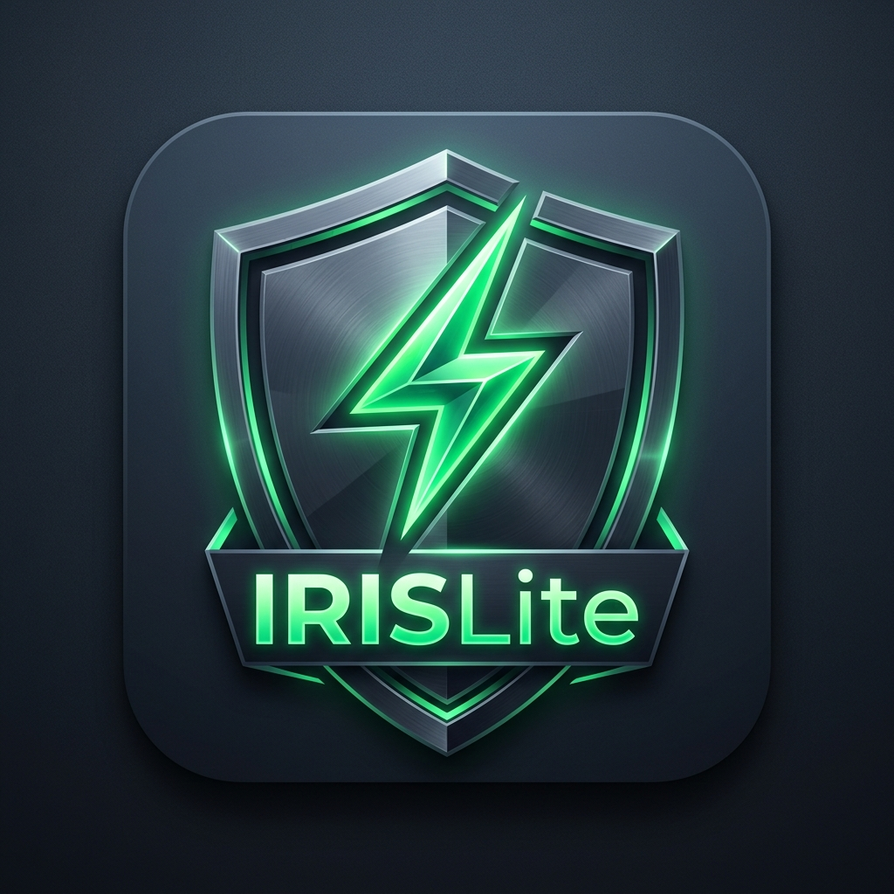

<a id="readme-top"></a>

<!-- PROJECT SHIELDS -->
[![Contributors][contributors-shield]][contributors-url]
[![Forks][forks-shield]][forks-url]
[![Stargazers][stars-shield]][stars-url]
[![Issues][issues-shield]][issues-url]
[![CC BY-NC 4.0 License][license-shield]][license-url]

<!-- PROJECT LOGO -->
<br />
<div align="center">
  <a href="https://github.com/ayan-sketch/IRISLite">
    
  </a>

  <h3 align="center">IRISLite ⚡</h3>

  <p align="center">
    An ultra-fast, zero-footprint browser extension accelerating the FBR IRIS 2.0 Return Filing Portal UI by up to 15x.
    <br />
    <a href="https://github.com/ayan-sketch/IRISLite"><strong>Explore the docs »</strong></a>
    <br />
    <br />
    <a href="https://github.com/ayan-sketch/IRISLite">View Demo</a>
    &middot;
    <a href="https://github.com/ayan-sketch/IRISLite/issues">Report Bug</a>
    &middot;
    <a href="https://github.com/ayan-sketch/IRISLite/issues">Request Feature</a>
  </p>
</div>

<!-- TABLE OF CONTENTS -->
<details>
  <summary>Table of Contents</summary>
  <ol>
    <li>
      <a href="#about-the-project">About The Project</a>
      <ul>
        <li><a href="#key-features">Key Features</a></li>
        <li><a href="#built-with">Built With</a></li>
      </ul>
    </li>
    <li>
      <a href="#getting-started">Getting Started</a>
      <ul>
        <li><a href="#prerequisites">Prerequisites</a></li>
        <li><a href="#installation">Installation</a></li>
      </ul>
    </li>
    <li><a href="#usage">Usage</a></li>
    <li><a href="#privacy--security">Privacy & Security</a></li>
    <li><a href="#chrome-web-store-compliance">Chrome Web Store Compliance</a></li>
    <li><a href="#contributing">Contributing</a></li>
    <li><a href="#license">License</a></li>
    <li><a href="#contact">Contact</a></li>
  </ol>
</details>

<!-- ABOUT THE PROJECT -->
## About The Project

**IRISLite** is a lightweight Chrome Extension (Manifest V3) specifically engineered for tax professionals, accountants, and taxpayers using Pakistan's Federal Board of Revenue (FBR) IRIS 2.0 portal ([https://iris.fbr.gov.pk](https://iris.fbr.gov.pk)).

The native IRIS form suffers from significant input typing lag (~500ms per character) due to synchronous client-side CryptoJS AES decryptions running repeatedly during Angular change detection cycles. **IRISLite** resolves this performance bottleneck by hooking into Webpack module decryptions in memory, reducing input latency down to **~25ms** (10x-15x typing speedup).

<p align="right">(<a href="#readme-top">back to top</a>)</p>

### Key Features

* **⚡ Webpack CryptoJS AES Decryption Memoization:**
  Hooks into IRIS Webpack chunk loading (`webpackChunkweb_ui`, module `13788`) and caches payload decryptions in volatile browser RAM. Eliminates heavy CPU re-decryption during typing and tab switching.
* **🔓 DevTools & Inspection Tool Unblocker:**
  Overrides custom window event listeners blocking standard browser accessibility, `F12`, `Ctrl+Shift+I/J/C`, and right-click `Inspect` element.
* **🚀 CSS Animation & Transition Killer:**
  Injects lightweight CSS overrides (`* { transition: none !important; animation: none !important; }`) for instant tab navigation without visual reflow delay.
* **💾 Storage Layer Memory Caching:**
  Caches repeated synchronous `localStorage.getItem` queries (`_s_user_details`, `_s_user_person_code`) in RAM memory.
* **🟢 Subtle Status Indicator:**
  Displays a discreet, semi-transparent thunder emoji (`⚡`) at the bottom-right corner showing saved decryption stats on hover/click.

<p align="right">(<a href="#readme-top">back to top</a>)</p>

### Built With

* [![Manifest V3][ManifestV3-badge]][ManifestV3-url]
* [![JavaScript][JS-badge]][JS-url]
* [![HTML5][HTML5-badge]][HTML5-url]
* [![CSS3][CSS3-badge]][CSS3-url]

<p align="right">(<a href="#readme-top">back to top</a>)</p>

<!-- GETTING STARTED -->
## Getting Started

Follow these simple steps to install IRISLite locally in your browser.

### Prerequisites

* **Google Chrome**, **Brave**, or **Microsoft Edge** browser.

### Installation

1. Clone the repository:
   ```sh
   git clone https://github.com/ayan-sketch/IRISLite.git
   ```
2. Open your browser and navigate to the extensions page:
   ```text
   chrome://extensions
   ```
3. Enable **Developer mode** via the toggle switch in the top-right corner.
4. Click **Load unpacked** in the top-left menu.
5. Select the `IRISLite` root directory.
6. Navigate to [https://iris.fbr.gov.pk](https://iris.fbr.gov.pk) — IRISLite will activate automatically!

<p align="right">(<a href="#readme-top">back to top</a>)</p>

<!-- USAGE EXAMPLES -->
## Usage

1. **Automatic Acceleration:** Once installed, open any return filing form on the IRIS 2.0 portal. IRISLite injects silently at `document_start`.
2. **Status Indicator:** Look for the small, semi-transparent thunder emoji (`⚡`) at the bottom-right corner of the page. Hover or click it to view live decryption stats.
3. **Control Popup:** Click the IRISLite icon in your browser toolbar to toggle features (AES Memoization, DevTools Unblocker, CSS Animations, Status Indicator).

<p align="right">(<a href="#readme-top">back to top</a>)</p>

<!-- PRIVACY & SECURITY -->
## Privacy & Security

* **100% Client-Side:** Operates strictly within your local browser RAM session.
* **Zero External Calls:** Contains no `fetch()`, `XMLHttpRequest`, or `WebSocket` connections to external servers.
* **Zero Disk Logging:** Passwords, PINs, CNICs, property details, and tax figures are never logged, tracked, or saved to disk.
* **Volatile RAM Cache:** All in-memory decryptions are destroyed instantly when the browser tab is closed.

<p align="right">(<a href="#readme-top">back to top</a>)</p>

<!-- CHROME WEB STORE COMPLIANCE -->
## Chrome Web Store Compliance

IRISLite is designed for Manifest V3 store policies:
* **Execution World:** Uses `"world": "MAIN"` in `content_scripts` with an inline DOM script injection fallback to safely hook page-scope Webpack chunks.
* **Event Override Declaration:** Overrides page-level event listeners to restore standard browser accessibility and developer inspection tools (`F12` / `contextmenu`).

<p align="right">(<a href="#readme-top">back to top</a>)</p>

<!-- CONTRIBUTING -->
## Contributing

Contributions are what make the open source community such an amazing place to learn, inspire, and create. Any contributions you make are **greatly appreciated**.

If you have a suggestion that would make this better, please fork the repo and create a pull request. You can also simply open an issue with the tag "enhancement".
Don't forget to give the project a star! Thanks again!

1. Fork the Project
2. Create your Feature Branch (`git checkout -b feature/AmazingFeature`)
3. Commit your Changes (`git commit -m 'Add some AmazingFeature'`)
4. Push to the Branch (`git push origin feature/AmazingFeature`)
5. Open a Pull Request

<p align="right">(<a href="#readme-top">back to top</a>)</p>

<!-- LICENSE -->
## License

Distributed under the Creative Commons Attribution-NonCommercial 4.0 International (CC BY-NC 4.0) License. Free to use, modify, and distribute for non-commercial purposes; commercial sale or resale is strictly prohibited. See `LICENSE` for details.

<p align="right">(<a href="#readme-top">back to top</a>)</p>

<!-- CONTACT -->
## Contact

Project Link: [https://github.com/ayan-sketch/IRISLite](https://github.com/ayan-sketch/IRISLite)

<p align="right">(<a href="#readme-top">back to top</a>)</p>

<!-- MARKDOWN LINKS & IMAGES -->
[contributors-shield]: https://img.shields.io/github/contributors/ayan-sketch/IRISLite.svg?style=for-the-badge
[contributors-url]: https://github.com/ayan-sketch/IRISLite/graphs/contributors
[forks-shield]: https://img.shields.io/github/forks/ayan-sketch/IRISLite.svg?style=for-the-badge
[forks-url]: https://github.com/ayan-sketch/IRISLite/network/members
[stars-shield]: https://img.shields.io/github/stars/ayan-sketch/IRISLite.svg?style=for-the-badge
[stars-url]: https://github.com/ayan-sketch/IRISLite/stargazers
[issues-shield]: https://img.shields.io/github/issues/ayan-sketch/IRISLite.svg?style=for-the-badge
[issues-url]: https://github.com/ayan-sketch/IRISLite/issues
[license-shield]: https://img.shields.io/github/license/ayan-sketch/IRISLite.svg?style=for-the-badge
[license-url]: https://github.com/ayan-sketch/IRISLite/blob/main/LICENSE
[ManifestV3-badge]: https://img.shields.io/badge/Manifest--V3-10b981?style=for-the-badge&logo=googlechrome&logoColor=white
[ManifestV3-url]: https://developer.chrome.com/docs/extensions/mv3/intro/
[JS-badge]: https://img.shields.io/badge/JavaScript-F7DF1E?style=for-the-badge&logo=javascript&logoColor=black
[JS-url]: https://developer.mozilla.org/en-US/docs/Web/JavaScript
[HTML5-badge]: https://img.shields.io/badge/HTML5-E34F26?style=for-the-badge&logo=html5&logoColor=white
[HTML5-url]: https://developer.mozilla.org/en-US/docs/Web/HTML
[CSS3-badge]: https://img.shields.io/badge/CSS3-1572B6?style=for-the-badge&logo=css3&logoColor=white
[CSS3-url]: https://developer.mozilla.org/en-US/docs/Web/CSS
